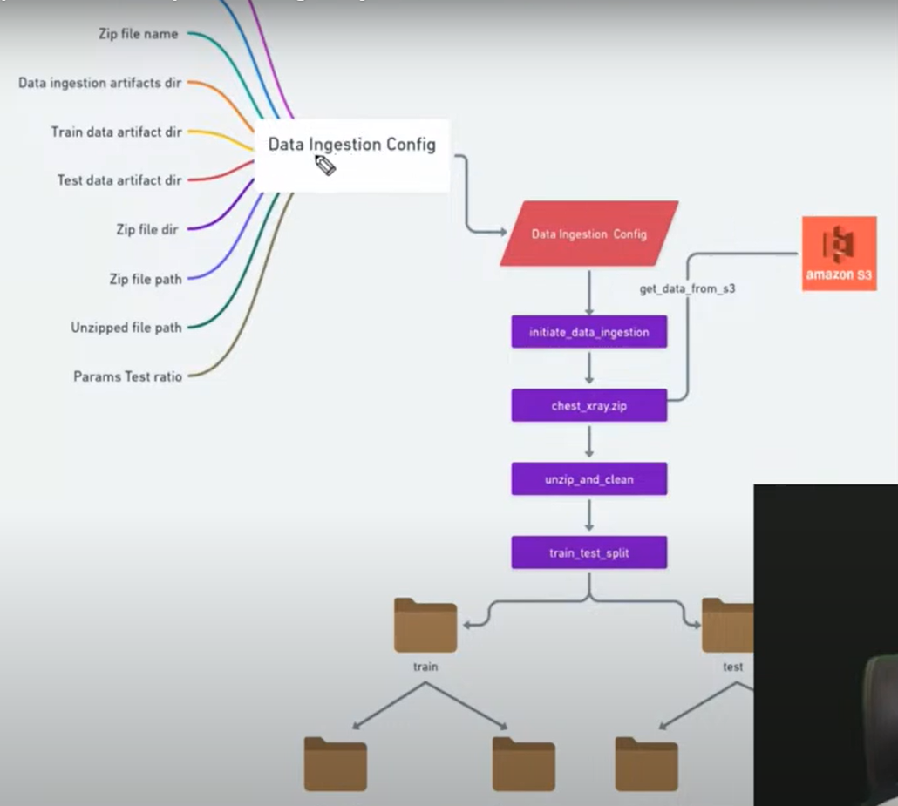
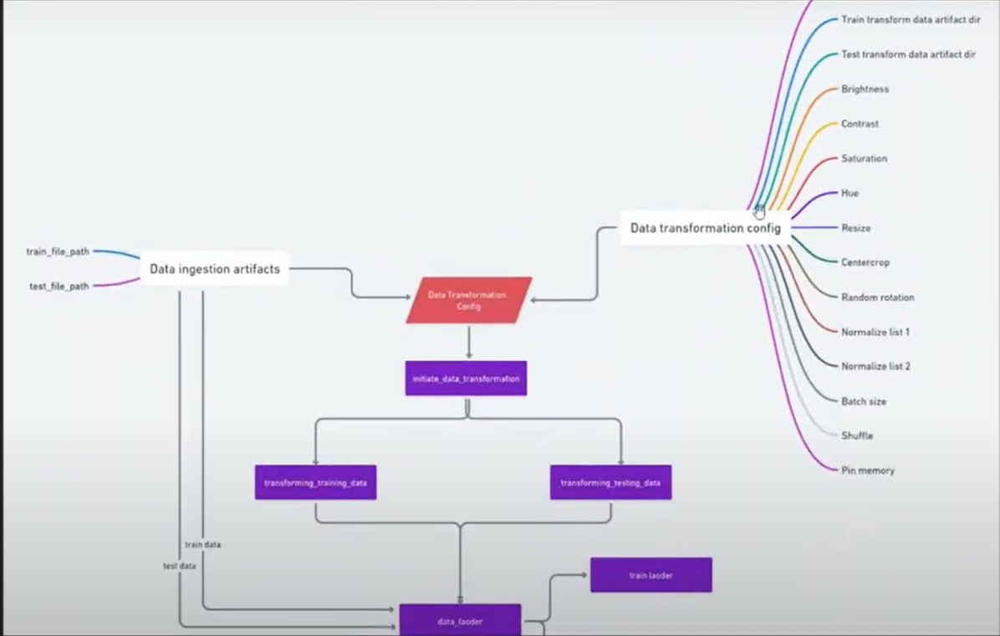
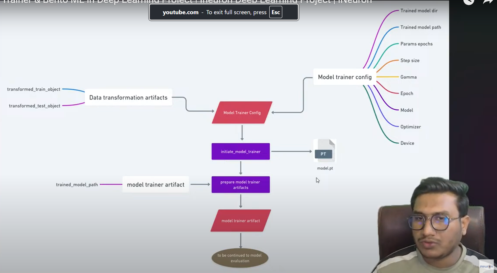

# dlproject1 - Pneumonia Xray Detection
This is the implementation of end to end deep learning project

## Project Overview:

The Pneumonia Detection project involves developing a deep learning model to identify pneumonia from lung X-ray images. The project focuses on using PyTorch for model training, data preprocessing with transformations, and deployment with tools like BentoML for production-ready services. The aim is to automate the detection of pneumonia, helping healthcare professionals quickly diagnose the disease from X-ray images.

## Key Techniques and Tools Used:

Python: The core programming language for implementing the machine learning pipeline.

PyTorch: The deep learning framework used to build and train the model for pneumonia detection from X-ray images.

Torchvision: Used for data transformations and augmentations such as resizing, rotation, and normalization.

BentoML: Deployed the trained model and pre-processing pipeline into production, making it accessible via an API.

S3: Utilized for cloud storage of the X-ray dataset and model artifacts, ensuring scalable storage and access.

Joblib: For saving and loading the preprocessor and transformation objects.

Streamlit (optional): For deployment as an interactive web application (though commented out in the code, could be useful for future applications).

## Steps Taken in the Project:

1. Data Ingestion:
The DataIngestion class is responsible for fetching the X-ray image data from AWS S3.

Cloud Storage Integration: It uses the S3operation class to sync data from the S3 bucket, ensuring that the local system receives the necessary files.

Data Paths: The class defines paths for training and test data, ensuring they are stored locally for future processing.

2. Data Transformation:
The DataTransformation class handles image preprocessing and transformation to make the data suitable for training.

Training Data Transformation: The training data undergoes various transformations like resizing, center cropping, random rotation, and color jittering, which help augment the data and improve model generalization.

Testing Data Transformation: Similar transformations are applied to the testing data, ensuring the data fed to the model during evaluation is consistent with the transformations used in training.

DataLoader: The transformed data is loaded using DataLoader from PyTorch, which makes it easy to batch process the images during training and testing.

3. Model Training:
The ModelTrainer class is responsible for training the model using deep learning techniques.

Model Architecture: The model used is a custom CNN architecture defined in the Net class. The model learns to classify images into different classes based on the features learned during training.

Loss Function & Optimizer: The CrossEntropyLoss function is used as the loss function, and SGD (Stochastic Gradient Descent) is used as the optimizer for training.

Training Loop: The model is trained for several epochs, and the performance is evaluated using the testing data. Accuracy and loss are tracked throughout the process.

4. Model Evaluation:
The ModelEvaluation class evaluates the trained model's performance on the test data.

Evaluation Metrics: The model’s performance is evaluated using accuracy, comparing the model's predictions with the actual labels in the test dataset.

Loss Calculation: The CrossEntropyLoss is computed during the evaluation phase to assess how well the model's predictions align with the ground truth.

Test Accuracy: The final test accuracy is calculated and logged, which indicates how well the model performs on unseen data.

5. Model Deployment:
Once the model is trained and evaluated, the ModelPusher class handles its deployment.

BentoML Integration: The trained model is saved in a BentoML format, allowing it to be packaged as a Docker container for easy deployment.

Push to Cloud: The Docker image is pushed to AWS ECR (Elastic Container Registry) for cloud-based deployment, ensuring the model is ready for production use.

## Challenges Faced and Overcome:

Data Handling: One of the main challenges was handling the large X-ray image dataset and ensuring efficient cloud storage and access. The integration with S3 allowed for seamless synchronization of large files.

Model Training: Training deep learning models on image data often requires considerable computational power. The use of PyTorch and its integration with GPU acceleration ensured that the training was efficient.

Deployment: Ensuring that the model could be deployed in a production environment was challenging. Using BentoML to create a deployable image container was an efficient solution.

## Results Achieved:

Model Performance: The model achieved a good level of accuracy in detecting pneumonia from X-ray images. The final accuracy achieved during testing can be reported as a metric of success.

Model Deployment: The model was successfully packaged using BentoML, and a cloud-based deployment pipeline was set up using AWS for easy accessibility via APIs.

Scalability: The model is now ready for scalable usage, as it can be deployed to handle multiple incoming prediction requests.

## Workflows

- constants
- congif_entity
- artifact_entity
- components
- pipeline
- main

## Github shortcuts:

Open terminal or git bash not powershell and cd directory where we need to create project and use mkdir dlproject1. Then go to github and create one repository by adding README file, .gitignore, license. Then do go to dlproject1 and do git clone path, and then open vs code by typing "code .". Once vs code is opened, do git initialization using below:

git init
git add README.md
git commit -m "first commit"
git branch -M main
git remote add origin git@github.com:Kmvucd/dlproject1.git
git push -u origin main

Now, git is synced with the vs code and the dlproject1 folder.

If any changes are done, steps are:
git add .
git status
git commit -m "Comments"
git push -u origin main

## How to setup 

1. Creating virtual environment
conda create -n venv python=3.8 -y

2. Activate venv
conda activate venv

3. Run requirements file
pip install -r requirements.txt

4. Setup AWS CLI
First, open aws console, and search with S3 and create bucket, Give unique bucket name and keep bucket type as "General purpose". Then dont make any changes and then click Create Bucket. Now, we are going to download access keys csv file, so search with "IAM" and then users, create user-> User Name -> Next -> Attach policies directly -> and below search with admin -> sekect AWS managed - job f... type -> Next -> click Create User. Once created, go into new user, then Create access key -> select CLI -> Tick confirmation -> Next -> Create access key -> Download .csv file

Download AWS CLI for windows and then install and usually it will be in ProgramFiles/Amazon. Need to create environment variables as user path.

5. In VS terminal, run aws --version, it will show version, else vs not recognizing CLI.

6. AWS Configuration
aws configure
Now, it will ask for access key and secret access key and region, use downloaded accesskeys from S3 bucket, and use them to configure my local to S3 bucket.

7. Data Ingestion Flowchart

8. Data Transformation Flowchart

9. Model Trainer Flowchart

main.py 
  └▶ TrainPipeline.run_pipeline()
        ├▶ start_data_ingestion()
        ├▶ start_data_transformation()
        └▶ start_model_trainer()
               └▶ ModelTrainer.initiate_model_trainer()
                      ├▶ self.train()    ← Training loop
                      ├▶ self.test()     ← Evaluation
                      ├▶ torch.save(...) ← Save `.pt` model
                      └▶ bentoml.pytorch.save_model(...) ← Register model

10. Code deployment in two different ways, one is using BentoML and other is using streamlit to predict
the input data 

a. For BentoML, First uncomment bentoml components especially in modelpusher, training, config, constant
Then run python main.py, once it is done, run
bentoml serve xray_service:5mz4ykj3ic7izvgs (keeps on changing)

b. For Streamlit, First uncomment streamlit components especially in modelpusher, training, config, constant
Then run python main.py, once it is done, run
streamlit run app.py, that will take me to the localhost
